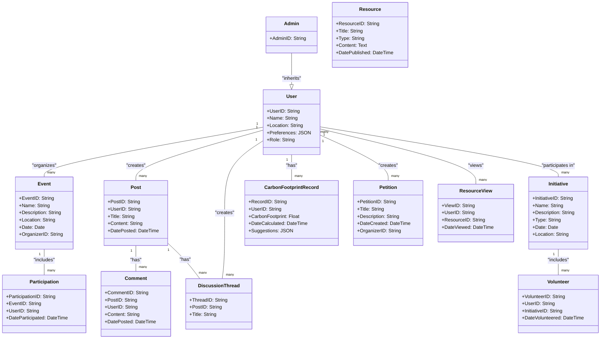

[18:23] Het Ashwinbhai Patel
## Object Model
 
Below is the object model for the ClimateCare platform, designed following Domain-Driven Design (DDD) principles. It outlines the entities, value objects, aggregates, and their relationships, focusing on entities like `User`, `Event`, `Post`, and their associated actions within the platform.
 

 